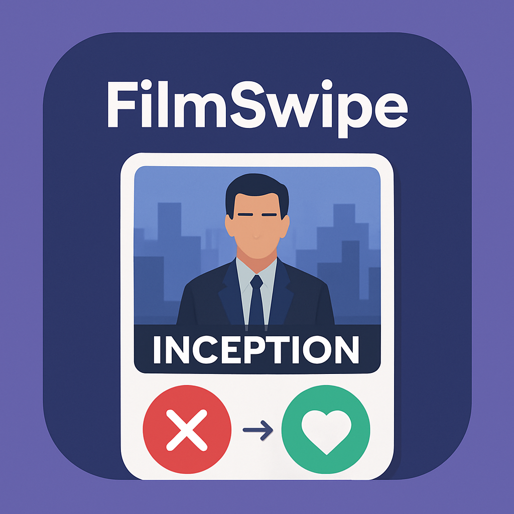
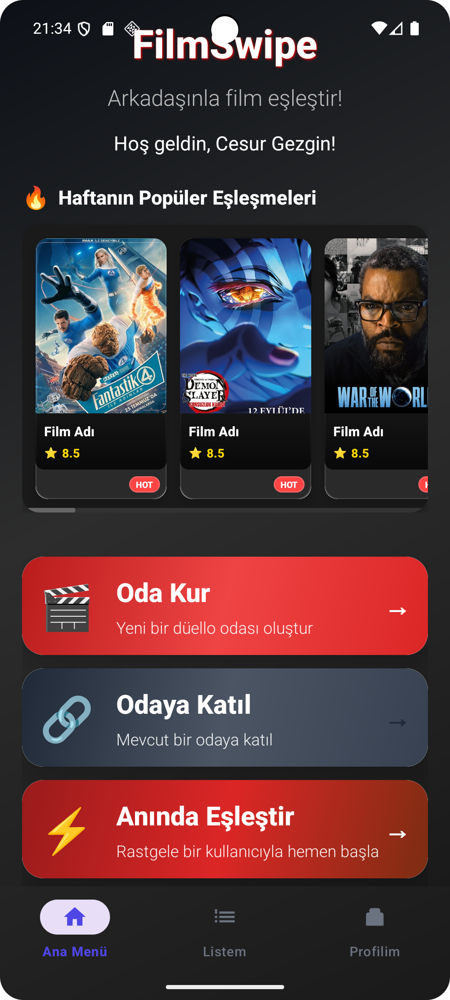
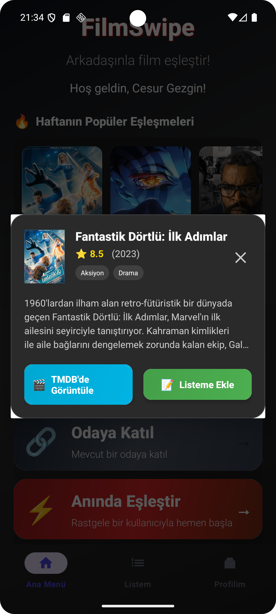
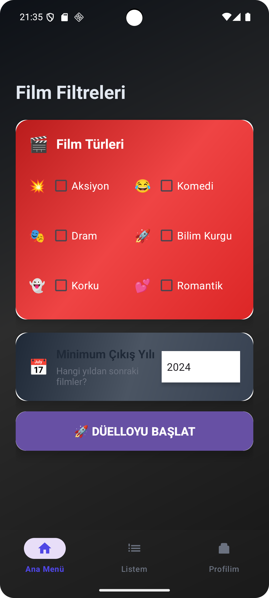
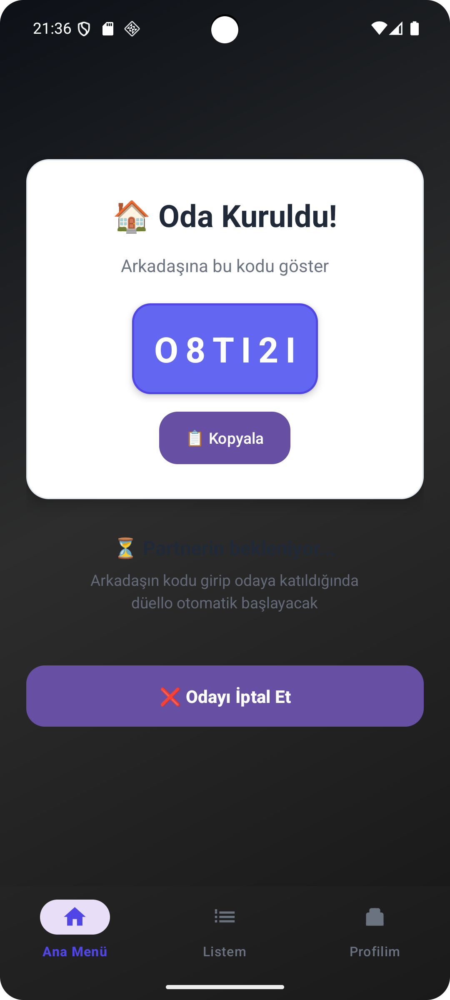

# 🎬 FilmSwipe

FilmSwipe, arkadaşlarınızla veya rastgele kişilerle film zevklerinizi eşleştirmenizi sağlayan, eğlenceli bir "Tinder benzeri" kaydırma (swipe) mekaniğine sahip bir Android uygulamasıdır. Arkadaşınızla "Bugün ne izlesek?" tartışmalarına son vermek için tasarlandı!

<p align="center">
  
</p>

## ✨ Öne Çıkan Özellikler

- 🎞️ **Popüler Filmleri Keşfet:** TMDB (The Movie Database) API entegrasyonu ile en güncel, trend olan ve popüler filmleri anında görüntüleyin.
- 👉 **Kaydır (Swipe) & Beğen:** Filmleri sağa kaydırarak beğenin, sola kaydırarak geçin. Gelişmiş `CardStackView` entegrasyonu ile akıcı bir kullanıcı deneyimi.
- 🤝 **Oda Kur ve Eşleş:** Kendinize özel bir oda (Room) oluşturun, kodunuzu arkadaşınızla paylaşın. İkiniz de aynı filmi sağa kaydırdığınızda **Eşleşme (Match)** gerçekleşir!
- ⚡ **Anında Eşleştir (Hızlı Düello):** Lobide beklemek istemeyenler için hızlı sistem ile rastgele biriyle hemen film eşleştirme düellosuna girin.
- 💬 **Canlı Sohbet (Chat):** Odaya katıldığınız kişilerle Firebase altyapısı sayesinde gerçek zamanlı ve hızlı mesajlaşın.
- 📌 **Kişisel İzleme Listesi:** Beğendiğiniz filmleri daha sonra göz atmak üzere cihazınıza (Room Database) kaydedin, internetiniz olmasa bile listenize ulaşın.
- 💎 **Premium Deneyim (Ad-Free):** Google Play Billing entegrasyonu ile tek tıkla reklamları sonsuza dek kaldırın.

---

## 📸 Ekran Görüntüleri

Uygulamanın arayüzünden çeşitli kesitler:

<p align="center">
  
  
  
  
</p>

---

## 🛠️ Kullanılan Teknolojiler & Mimari

Proje, güncel Android geliştirme standartlarına (Modern Android Development - MAD) uygun olarak geliştirilmiş ve Clean Architecture prensipleriyle desteklenmiştir.

- **Dil:** Kotlin
- **Mimari:** MVVM (Model-View-ViewModel) 
- **Dependency Injection (Bağımlılık Enjeksiyonu):** Dagger Hilt
- **Asenkron & Reaktif Programlama:** Kotlin Coroutines & Flow (StateFlow)
- **Ağ İstekleri (Networking):** Retrofit & Gson
- **Veritabanı:**
  - **Yerel (Local):** Room Database (İzleme Listesi için)
  - **Bulut (Cloud):** Firebase Realtime Database (Eşleşme odaları ve Sohbet için)
- **Görsel Yükleme:** Glide
- **Kullanıcı Arayüzü (UI) & Navigasyon:** XML, ViewBinding, Navigation Component (Single-Activity Architecture)
- **Özel Görünümler & Animasyonlar:** Lottie Animations, CardStackView
- **Para Kazanma & Reklam:** Google AdMob, Google Play In-App Billing Library
- **Geri Uç (Backend):** Firebase Cloud Functions (Özel sunucu mantıkları için)

---

## 🚀 Kurulum & Geliştirme

Projeyi kendi bilgisayarınızda derleyip çalıştırmak için aşağıdaki adımları izleyebilirsiniz.

1. **Repoyu Klonlayın:**
   ```bash
   git clone https://github.com/EnesKaraca44/FilmSwipe.git
   ```
2. **Android Studio'da Açın:**
   Klonladığınız klasörü Android Studio üzerinden açın.
3. **API Key Ayarları:**
   Proje kök dizininde `local.properties` dosyanızı açın (yoksa oluşturun) ve The Movie Database (TMDB) API anahtarınızı ekleyin:
   ```properties
   TMDB_API_KEY="SİZİN_TMDB_API_ANAHTARINIZ"
   ```
4. **Çalıştırın:**
   Emülatörünüzü veya fiziksel cihazınızı seçerek uygulamayı başlatın.

---

## 🤝 Katkıda Bulunma

Projeye katkı sağlamak isterseniz; hata bildirimleri (issues) oluşturabilir veya pull request (PR) gönderebilirsiniz. Katkılarınız uygulamanın gelişmesi için çok değerlidir!

<p align="center">
  <i>FilmSwipe ile iyi seyirler! 🍿</i>
</p>
